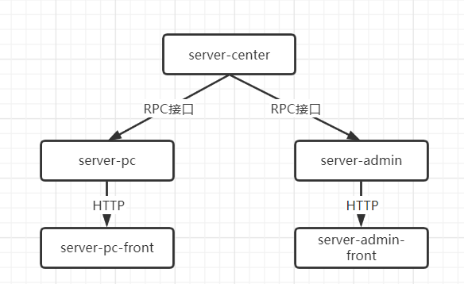

RPC架构的Java后端基础服务，可在此基础上直接进行开发，已集成登录注册模块

## 使用技术
- springboot
- mybatis
- mysql
- dubbo + zookeeper（RPC）

## 项目结构
该项目是个简单的RPC项目，不会对具体的服务进行提取，只是将一个项目分为了Center端（提供RPC接口），管理端（后台管理），PC端（用户使用）

调用关系如下:

这样设计的原因是提供给用户使用的接口和后台管理使用的接口有共用的，而且针对Center端提供的RPC接口设计了鉴权（鉴权这里本应该使用统一配置中心，这里为了不借用过多的中间件，在运行前搭建过多环境，就直接采用mysql对授权信息进行保存，调用具体接口添加授权应用），保证了接口的安全性，并且在server-pc、server-admin项目中对接口进行了再一次的封装，对不用的接口也进行了屏蔽。

在接口的参数检验上使用JSR303，只需要在具体实体类上使用注解即可，全局的异常处理对参数异常信息进行返回。

日志处理上采用自定义注解@WebLog，在方法上添加可以对方法的入参和结果进行打印，排错更加方便。

## 环境
- JAVA 8
- MAVEN 3.5.2
- MYSQL（使用PhpStudy，方便）
- Zookeeper

## 联系方式
tqb820965236@163.com
